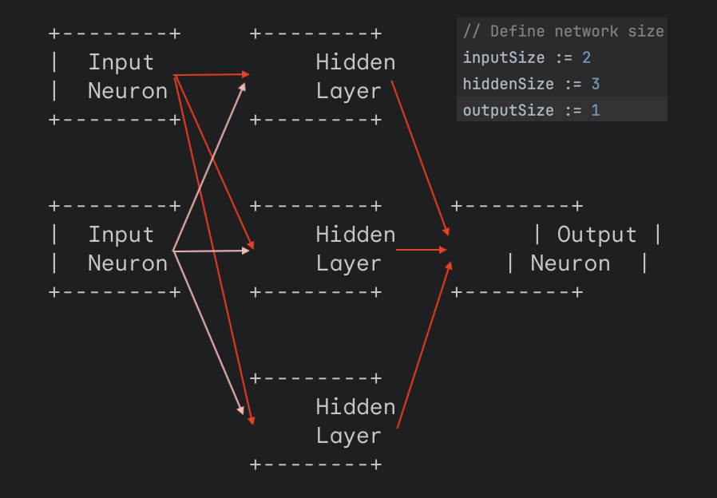

# Basic Neural Network visualization

- Each arrow represents a connection between neurons.
- There are weights associated with each connection.
 
`network.inputLayer[i].weights[j] = rand.Float64()`
 
`network.hiddenLayer[i].weights[j] = rand.Float64()`

# explanation
> There are three layers:
- Input layer: Contains 2 neurons (as defined by inputSize in the code).
`	// Sample input data
  inputs := []float64{0.1, 0.2}`
- Hidden layer: Contains 3 neurons (as defined by hiddenSize in the code).
- Output layer: Contains 1 neuron (as defined by outputSize in the code).
- Each neuron in the hidden and output layer receives input from all neurons in the previous layer.
- The arrows represent connections between neurons. These connections have weights associated with them, which are initially randomized in the code (initializeNetwork).
- The circles represent the neurons themselves. Inside each neuron, an activation function (sigmoid in this case) is applied to a weighted sum of the inputs.

# Run the code
`$ go run cmd/basic/main.go`
