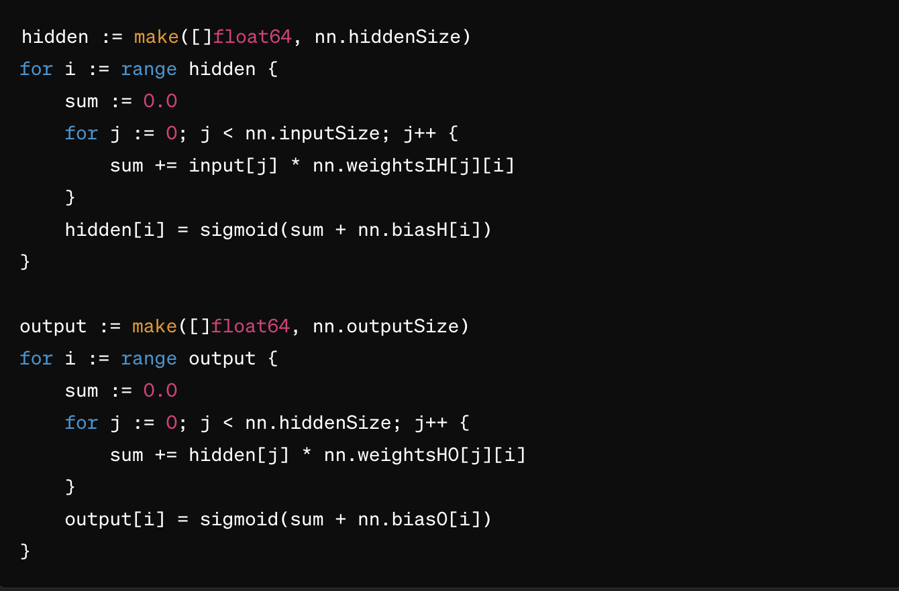
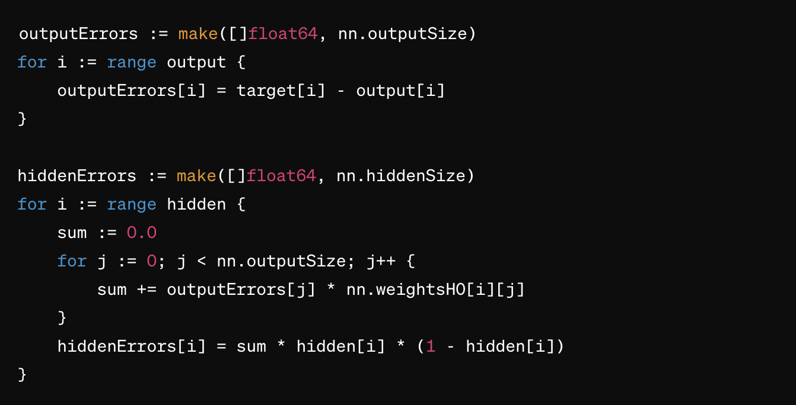
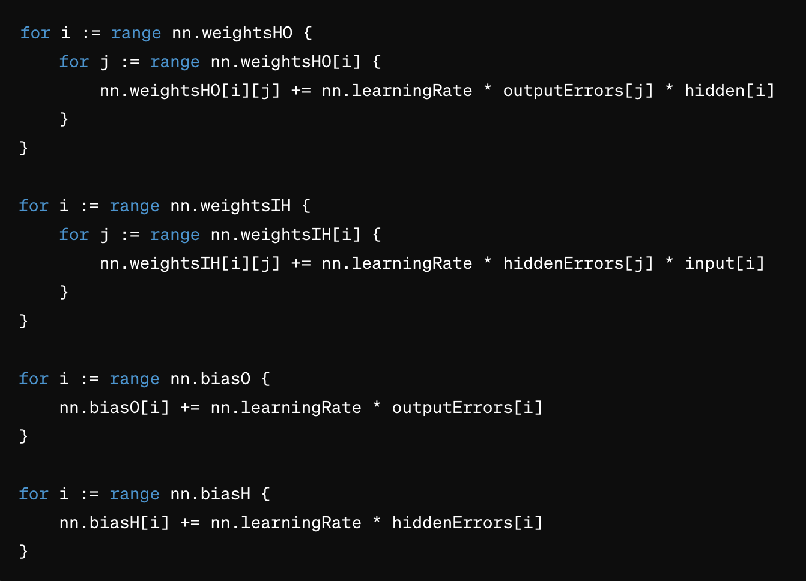

# Training
The training function in the provided Go code is the train method of the
'NeuraINetwork struct. This function is responsible for training the neural network using the backpropagation algorithm. Let's break down the training process step by step:
1. Forward Propagation:
   • The input data is propagated forward through the network to generate predictions.
   • For each neuron in the hidden layer, the weighted sum of inputs is computed, followed by the application of the sigmoid activation function.
   • Similarly, for each neuron in the output layer, the weighted sum of hidden layer outputs is computed, followed by the sigmoid activation function.
2. Compute Errors:
   • The output errors are computed by finding the difference between the predicted output and the actual target values.
   • The hidden layer errors are computed by backpropagating the output errors through the network, using the weights between the hidden and output layers.
3. Update Weights and Biases:
   • The weights and biases are updated based on the computed errors and the learning rate.
   • For each weight in the weights HO matrix (weights between hidden and output layers), the update rule is applied using the output errors and hidden layer outputs.
   • For each weight in the weightsIH matrix (weights between input and hidden layers), the update rule is applied using the hidden layer errors and input data.
   • Similarly, biases for the output and hidden layers are updated based on their respective errors and the learning rate.

Here's a more detailed explanation of the key steps within the train function:
`The training function iterates through the training data multiple times (epochs) to update the network parameters and minimize the error, gradually improving the network's ability to make accurate predictions.`

- <b><u>Forward Propagation</u></b> (This code calculates the hidden layer outputs ( hidden ') and the final output of the network ('output *) by applying the sigmoid activation function to the weighted sums of inputs.):
    
- <b><u>Compute Errors</u></b>:
  
  • Here, outputErrors are computed by finding the differences between the predicted output and the target values. 
  • 'hiddenErrors" are computed by backpropagating the output errors through the network using the weights between the hidden and output layers.  
- <b><u>Update Weights and Biases</u></b>:
  
  • This part updates the weights and biases based on the computed errors and the learning rate. The weights and biases are adjusted to minimize the error during training.  

# Neural Network Parameters
`inputSize := 2
hiddenSize := 3
outputSize := 1`

# Run the code
`$ go run cmd/withTraining/main.go`
