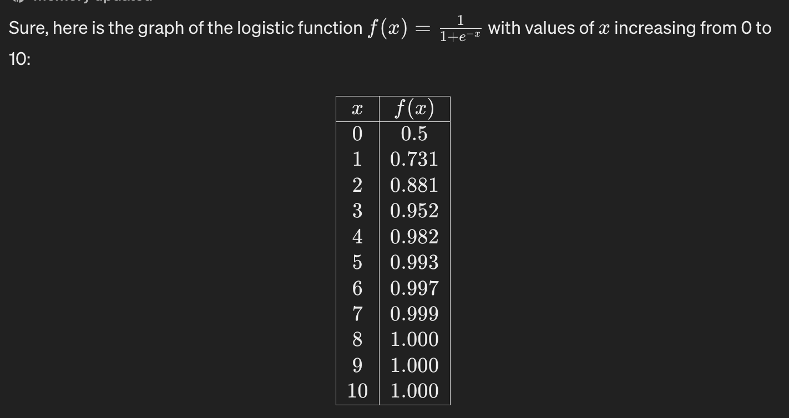
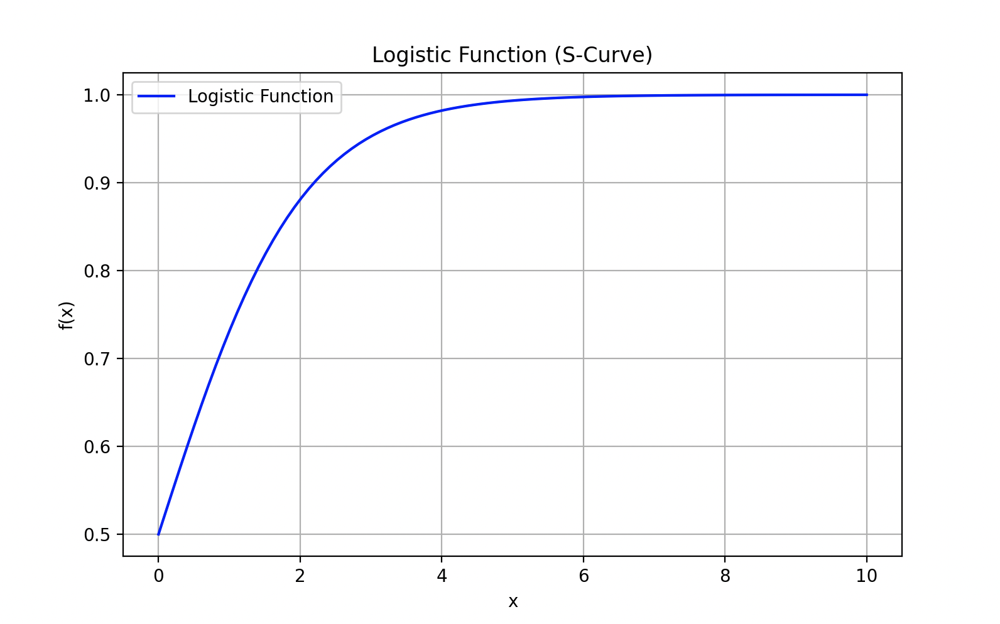
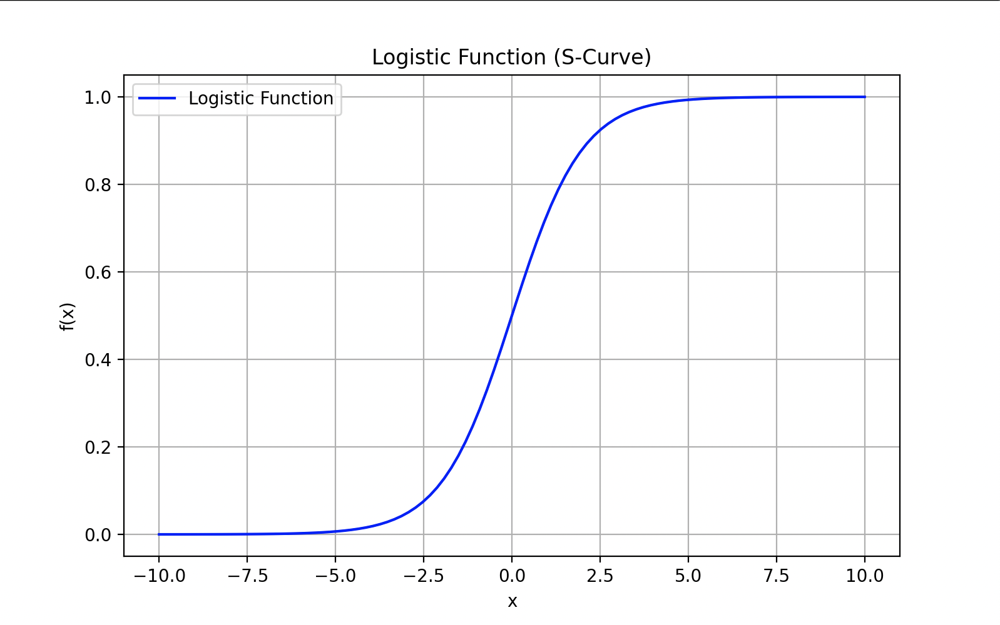
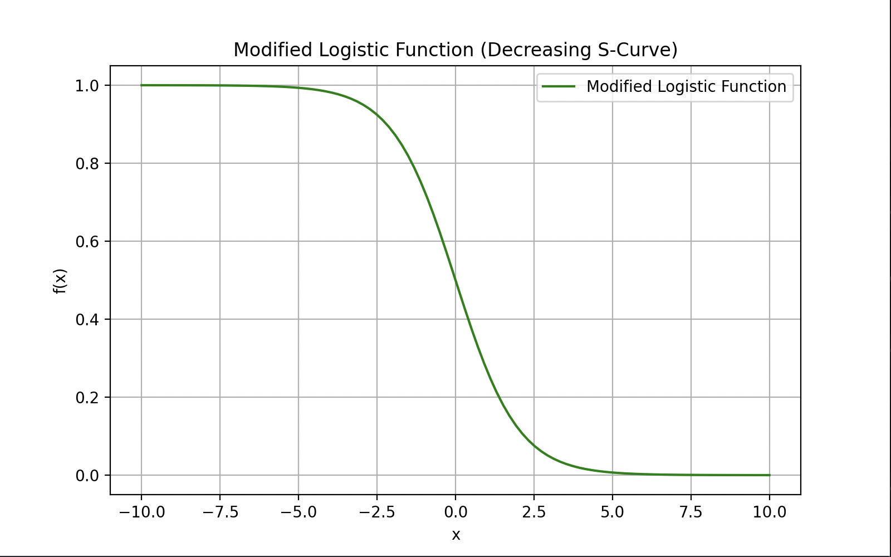

# Why sigmoid functions
Sigmoid functions, such as the logistic function, are highly useful in machine learning (ML) for several reasons:
1. Probabilistic Interpretation: Sigmoid functions map input values to a range between 0 and 1.
   This property allows them to model probabilities, which is crucial in many ML tasks, especially binary classification. For example, in logistic regression, the output of the sigmoid function can be interpreted as the probability of an instance belonging to a particular class.
2. Smoothness and Continuity: Sigmoid functions are smooth and continuous everywhere. This property is beneficial for gradient-based optimization algorithms, such as stochastic gradient descent (SGD), which are widely used in training ML models. The smoothness of the sigmoid function's curve enables efficient gradient computations and helps avoid convergence issues during optimization.
3. Monotonicity: Sigmoid functions are monotonically increasing or decreasing, depending on their formulation. This property ensures that as the input increases or decreases, the output also increases or decreases without any sudden jumps or oscillations. Monotonicity is desirable in ML models as it aids in learning meaningful patterns and relationships from the data.
4. Nonlinearity: Sigmoid functions introduce nonlinearity into ML models. Nonlinearity is crucial for capturing complex relationships and patterns in data that linear models cannot represent effectively. Sigmoidal activation functions, such as the sigmoid and tan functions, are commonly used in neural networks to introduce nonlinearity into the network's computations.
5. Normalization: Sigmoid functions normalize the output to a fixed range, which can be advantageous for ensuring that model outputs are bounded and interpretable. For example, in binary classification tasks, a sigmoid function can ensure that predicted probabilities remain between O and 1, making them suitable for decision thresholds.
6. Versatility: Sigmoid functions can be easily integrated into various ML models and architectures, including logistic regression, neural networks, and decision trees. Their versatility allows researchers and practitioners to apply them in a wide range of ML tasks, from classification and regression to anomaly c J, ›tion and natural language processing.

# The basic sigmoid function used in this example
The standard logistic function 
`
f(x) = 1/(1+e^−x)
`

(with a negative exponent) is more commonly used
in machine learning for several reasons:
1. Output Range: The standard logistic function outputs values between O and 1, which are often interpreted as probabilities. This makes it well-suited for binary classification tasks, where the output can be interpreted as the probability of an instance belonging to one class (e.g., positive class in binary classification).
2. Sigmoidal Shape: The S-shaped curve of the standard logistic function is monotonic, meaning it always increases or decreases without any turning points. This property is beneficial for gradient-based optimization algorithms used in training machine learning models.
3. Numerical Stability: The standard logistic function tends to be numerically stable during computations compared to its reflection with a positive exponent, especially when dealing with large or small input values. This stability is important for efficient and accurate computations in machine learning algorithms.
   While the reflection of the logistic function with a positive exponent f(a) = It has its uses in
   certain contexts, such as when modeling decreasing probabilities or in specific mathematical analyses, the standard logistic function with a negative exponent is more commonly employed in machine learning for its properties suited to classification tasks and optimization algorithms.

# expected output for range of input 0 to 10
- Run the code `$ python sigmoid_functions/negative_exponent_0_10.py`

# changing the range of inputs to -10 to 10
- Run the code `$ python sigmoid_functions/negative_exponent_negative_10_10.py`

# using a positive exponent (unusual in ML)
- Run the code `$ python sigmoid_functions/positive_exponent_negative_10_10.py`

